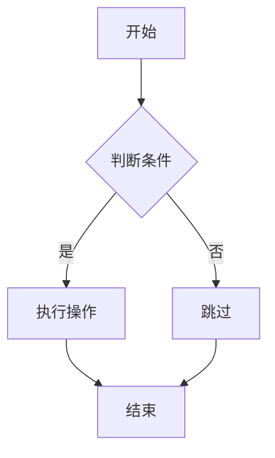

## Markdown预览器

我创建了一个功能强大的在线Markdown预览器，支持实时编辑和预览，特别适合编写和调试Markdown文档。

### 主要功能

- **实时预览**: 左侧编辑，右侧实时显示渲染结果
- **语法高亮**: 支持代码块的语法高亮显示
- **Mermaid图表**: 完整支持Mermaid流程图、时序图等
- **响应式设计**: 适配各种屏幕尺寸
- **深色模式**: 支持明暗主题切换
- **快捷操作**: 一键清空、键盘快捷键支持

### 支持的Markdown语法

#### 基础语法
- 标题 (H1-H6)
- **粗体** 和 *斜体*
- 列表（有序和无序）
- 链接和图片
- 引用块
- 代码块
- 表格

#### 扩展功能
- GitHub风格的Markdown (GFM)
- 代码语法高亮
- Mermaid图表渲染

### Mermaid图表示例

预览器支持各种类型的Mermaid图表：

```markdown

```

### 使用方法

1. 在左侧编辑器中输入Markdown内容
2. 右侧会实时显示渲染结果
3. 支持Mermaid图表，使用 \`\`\`mermaid 代码块
4. 点击主题切换按钮可以切换明暗模式
5. 使用清空按钮可以快速清除所有内容

### 访问地址

? [点击这里使用Markdown预览器](/markdown-preview/)

这个工具特别适合：
- 编写技术文档
- 制作流程图和架构图
- 学习Markdown语法
- 快速预览Markdown效果

希望这个工具能够帮助大家更好地编写和预览Markdown文档！